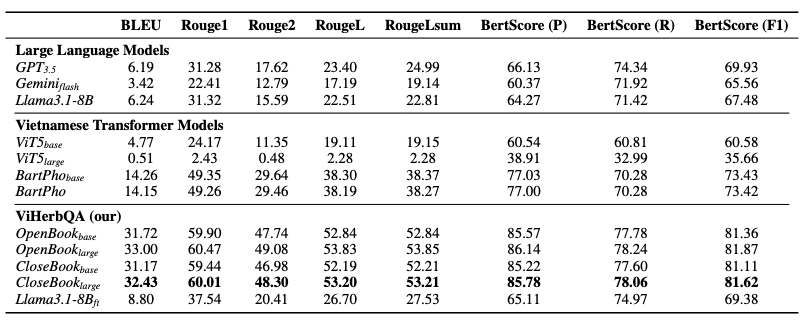
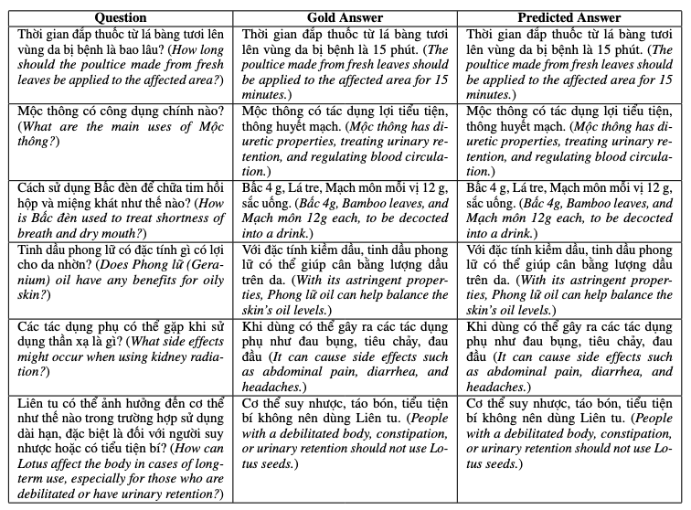

# ViHerbQA: A Robust QA Model for Vietnamese Traditional Herbal Medicine

This repository contains the source code and resources for ViHerbQA model developed as part of the paper named **ViHerbQA: A Robust QA Model for Vietnamese Traditional Herbal Medicine**.

# Table of Contents
- [Overview](#overview)
- [Installation](#installation)
- [Usage](#usage)
- [Data](#data)
- [Result](#result)
- [License](#license)
- [Acknowledgements](#acknowledgements)

# Overview
ViHerbQA is a question-answering model developed for Vietnamese Traditional Herbal Medicine (VTHM). It uses a dataset of over 208,000 question-answer pairs generated by large language models. Built on the ViT5 model, it undergoes pre-training for open-book QA and fine-tuning for close-book QA to provide accurate answers in the VTHM domain.
The dataset, created from 745 herbal articles, covers various herbal knowledge, including chemical compositions and traditional treatments. ViHerbQA outperforms other Vietnamese QA systems, making it a valuable tool for researchers and practitioners in traditional medicine.

# Installation
1. Clone the repository:
```bash
git clone https://github.com/queenley/ViHerbQA.git
cd ViHerbQA
```

2. Install the required packages:
```bash
bash install.sh
bash install_llm.sh
```

# Usage 
### Train
```bash
bash train.sh
```
### Predict
```bash
bash predict.sh
```
### Evaluation
```bash
bash eval.sh
```

# Data
Please contact me via e-mail quyen.uit@gmail.com to get the dataset.

# Result 



# License

This project is licensed under the MIT License.

### MIT License

MIT License

Copyright (c) [2024] [Quinley Truong] - see the [LICENSE](LICENSE) file for details.

Permission is hereby granted, free of charge, to any person obtaining a copy of this software and associated documentation files (the "Software"), to deal in the Software without restriction, including without limitation the rights to use, copy, modify, merge, publish, distribute, sublicense, and/or sell copies of the Software, and to permit persons to whom the Software is furnished to do so, subject to the following conditions:

1. The above copyright notice and this permission notice shall be included in all copies or substantial portions of the Software.

2. THE SOFTWARE IS PROVIDED "AS IS", WITHOUT WARRANTY OF ANY KIND, EXPRESS OR IMPLIED, INCLUDING BUT NOT LIMITED TO THE WARRANTIES OF MERCHANTABILITY, FITNESS FOR A PARTICULAR PURPOSE AND NONINFRINGEMENT. IN NO EVENT SHALL THE AUTHORS OR COPYRIGHT HOLDERS BE LIABLE FOR ANY CLAIM, DAMAGES OR OTHER LIABILITY, WHETHER IN AN ACTION OF CONTRACT, TORT OR OTHERWISE, ARISING FROM, OUT OF OR IN CONNECTION WITH THE SOFTWARE OR THE USE OR OTHER DEALINGS IN THE SOFTWARE.


# Acknowledgements

We would like to express our gratitude to the following individuals and organizations for their support and contributions to this project:

- **PhD. Long Nguyen**: For providing valuable feedback and guidance throughout the development process.
- **ViT5** & **MedicalGPT**: Special thanks to the developers of [ViT5](https://github.com/vietai/ViT5/tree/main) and [MedicalGPT](https://github.com/shibing624/MedicalGPT) for their amazing work, which was instrumental in our implementation.

Additionally, we would like to acknowledge the broader open-source community for their contributions and resources that made this project achievable.
